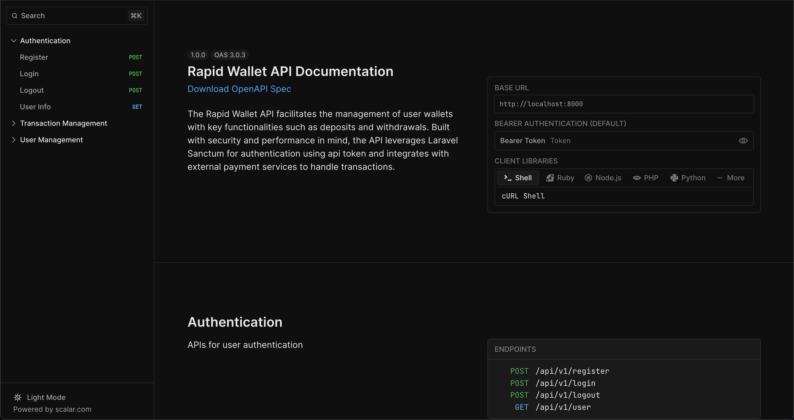

# Rapid Wallet

This project is built with Laravel 11, providing functionalities for deposits and withdrawals. It includes asynchronous processing, Redis caching, testing with Pest, comprehensive API documentation using Scribe and simple authorization.

## Features

- **Deposit and Withdrawal**: Allows users to deposit and withdraw funds from their wallet.
- **Asynchronous Processing**: Uses event-driven architecture for processing transactions asynchronously.
- **Redis Caching**: Implements Redis caching for frequently accessed data to improve performance.
- **Detailed Logging**: Includes detailed logging for transactions and error handling.
- **Automated Testing**: Contains unit tests and integration tests using Pest to ensure code quality.
- **API Documentation**: Generates comprehensive API documentation using Scribe.
- **Role-based Access Control**: Uses `spatie/laravel-permission` to manage roles and permissions.

## Libraries and Tools Used

- **Laravel**: The PHP framework used for building the application.
- **Redis**: Used for caching frequently accessed data.
- **Scribe**: Generates API documentation.
- **Pest**: Used for unit and integration testing.
- **Laravel Horizon**: Manages Redis queues.
- **spatie/laravel-permission**: Manages roles and permissions for RBAC.
- **GuzzleHTTP**: Simplifies HTTP requests and integrations.

## Techniques Implemented

- **Event-Driven Architecture**: Uses events and listeners for asynchronous processing.
  - [Laravel Events and Listeners](https://laravel.com/docs/11.x/events)
- **Redis Caching**: Implements caching strategy to improve performance.
  - [Laravel Redis](https://laravel.com/docs/11.x/redis)
- **Automated Testing**: Ensures code quality through unit and integration tests.
  - [Pest](https://pestphp.com/)
- **API Documentation**: Generates API documentation automatically.
  - [Scribe](https://scribe.knuckles.wtf/)
- **Role-based Access Control (RBAC)**: Manages user roles and permissions.
  - [spatie/laravel-permission](https://spatie.be/docs/laravel-permission/v4/introduction)

## Installation

1. Clone the repository:
   ```bash
   git clone https://github.com/andynur/rapid-wallet.git
   cd rapid-wallet
   ```

2. Install dependencies:
   ```bash
   composer install
   yarn # or npm install
   ```

3. Copy the `.env` file and configure your environment variables:
   ```bash
   cp .env.example .env
   ```

4. Generate application key:
   ```bash
   php artisan key:generate
   ```

5. Set up the database and run migrations:
   ```bash
   php artisan migrate
   ```

6. Seed the database with roles and permissions:
   ```bash
   php artisan db:seed
   ```

7. Start the local development server:
   ```bash
   php artisan serve
   ```

8. Start the queue listener
   ```bash
   php artisan queue:work
   ```   

## Usage

### UI Client

Access the login page at `http://localhost:8000/login`.


### Running Tests

Run the unit and integration tests using Pest:
```bash
php artisan test
```

### Documentation

Generate API documentation using Scribe:
```bash
php artisan scribe:generate
```

Access the generated documentation at `http://localhost:8000/docs`.




## Role-based Access Control

This project uses `spatie/laravel-permission` to manage roles and permissions. The default roles are:

- **Admin**: Has access to all endpoints and can manage users.
- **User**: Has access to their own transactions and wallet operations.

## Contributing

1. Fork the repository.
2. Create a new branch (`git checkout -b feature/your-feature`).
3. Make your changes and commit them (`git commit -am 'Add some feature'`).
4. Push to the branch (`git push origin feature/your-feature`).
5. Create a new Pull Request.

## License

This project is licensed under the MIT License.

## References

- [Laravel Documentation](https://laravel.com/docs)
- [Laravel Events and Listeners](https://laravel.com/docs/11.x/events)
- [Laravel Redis](https://laravel.com/docs/11.x/redis)
- [Pest](https://pestphp.com/)
- [Scribe](https://scribe.knuckles.wtf/)
- [spatie/laravel-permission](https://spatie.be/docs/laravel-permission/v4/introduction)
